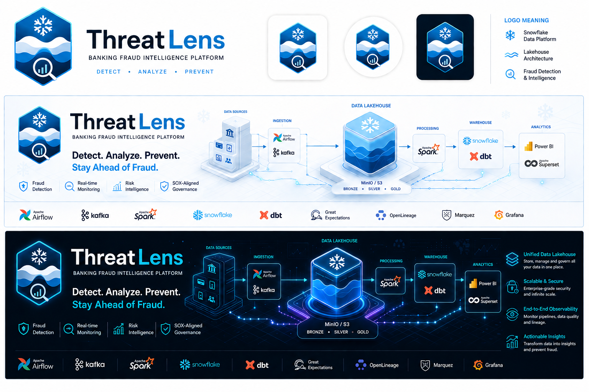

# FraudLens

FraudLens is a standards-first banking fraud analytics project built around a realistic operating model for payments, accounts, fraud risk, and case management.

Phase 0 established the repository foundation. Phase 1 adds the platform integration contract that connects FraudLens to an external Docker runtime instead of duplicating the stack inside this repo.

## Platform Position

- FraudLens treats `Shreyash2942/Data-Lab` as the canonical runtime source for local platform services in Phase 1.
- This repository does not vendor Docker Compose files or service images for the platform in this phase.
- The repo documents how FraudLens depends on Airflow, PostgreSQL, MinIO, Prometheus, Grafana, and Marquez/OpenLineage as platform capabilities.
- Those capabilities may run inside one local all-in-one container for development and portfolio use.
- Local configuration is represented with safe example files only.

The external runtime source:

- `https://github.com/Shreyash2942/Data-Lab.git`

## Warehouse Strategy

- Snowflake remains the intended analytical and portfolio target platform.
- Spark and Hive in Data-Lab are used as local, cost-saving stand-ins for development, prototyping, and selected test flows.
- Only the necessary subset of work needs to run against real Snowflake for credibility and final validation.
- The local sandbox is a practical developer environment, not a claim of production deployment topology.

## Design Principles

- ISO 20022-inspired semantic structure for payments, accounts, and transactions
- BIAN-inspired domain grouping and business naming
- Purpose-built fraud operations resources for alerts, cases, investigations, and decisions
- Strong traceability, ownership, and control design aligned to SOX-style expectations

## Repository Layout

- `.github/` GitHub templates, workflow conventions, and code ownership
- `documents/` charter, roadmap, architecture, governance, and project management docs
- `specs/` versioned structured contracts and relationship definitions
- `standards/` naming, modeling, controls, and auditability standards
- `airflow/`, `dbt/`, `warehouse/`, `monitoring/`, `analytics/`, `data/`, `platform/` integration and future implementation roots

## Architecture Diagram

## Getting Started

Start with these documents:

1. `documents/project-charter.md`
2. `documents/implementation-roadmap.md`
3. `documents/architecture-overview.md`
4. `documents/platform-foundation-guide.md`
5. `documents/platform-validation-runbook.md`
6. `specs/README.md`
7. `standards/README.md`

## Current Status

Phase 0 is implemented as a repo baseline. Phase 1 is implemented as an external-runtime integration layer with documentation, service contracts, and local configuration examples. Phase 2 adds a deterministic synthetic dataset generator with mixed and blueprint-curated batch modes, seeded Faker-backed realism, 21 governed CSV datasets, batch-style landing/control/quality outputs, validation reporting, organization-aware dashboard controls, and optional MinIO upload for local data-foundation work.
